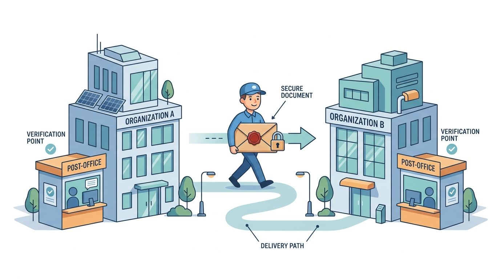
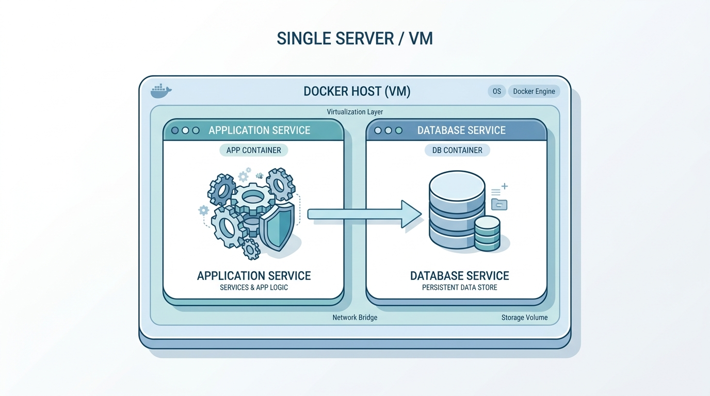
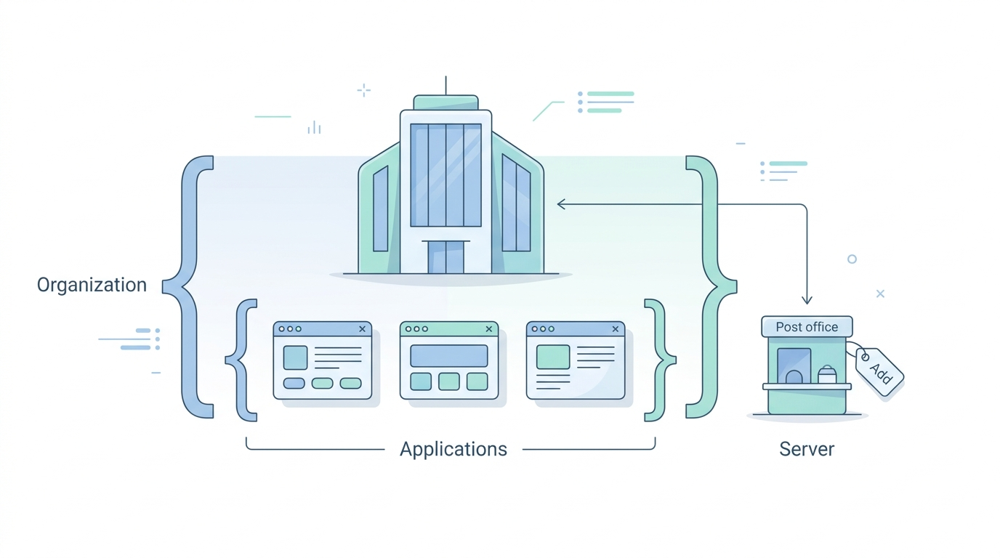
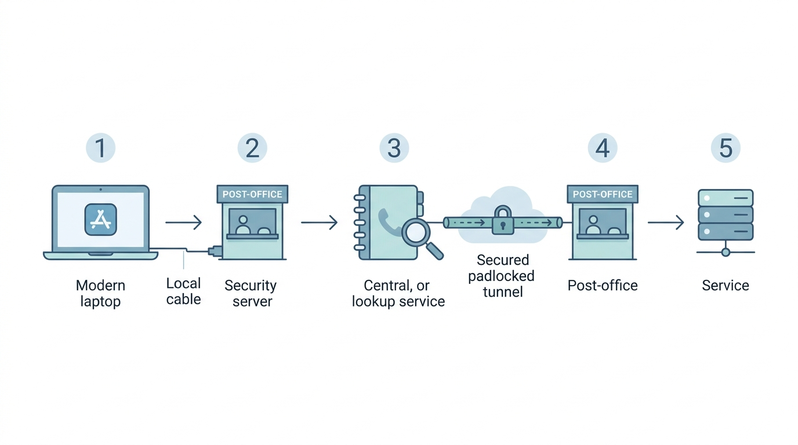
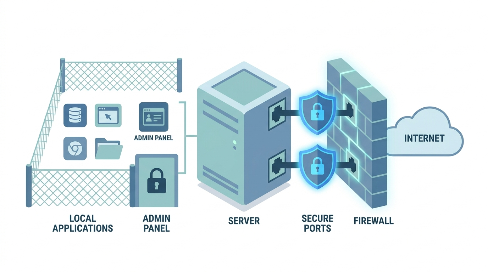

# Сервер безопасности Тундук: руководство для новичков

Это руководство собрано из реальных вопросов человека, который впервые столкнулся с Тундуком, и ответов на них. Оно объясняет простыми словами, что такое сервер безопасности, как он развёрнут через Docker, как через него ходят запросы между организациями и как всё это не сломать с точки зрения безопасности.

Если ты вообще не в теме - читай подряд, секции идут от простого к сложному. Если ищешь конкретику - прыгай по оглавлению.

Оговорка про картинки: подписи на иллюстрациях на английском (так их сгенерировал инструмент). На смысл это не влияет, схемы понятны и так, а под каждой картинкой есть пояснение по-русски.

## оглавление

1. [что это вообще такое](#что-это-вообще-такое)
2. [из чего состоит стек](#из-чего-состоит-стек)
3. [почему не пришлось собирать свой образ](#почему-не-пришлось-собирать-свой-образ)
4. [как запустить](#как-запустить)
5. [что нельзя автоматизировать: регистрация](#что-нельзя-автоматизировать-регистрация)
6. [один сервер на все приложения](#один-сервер-на-все-приложения)
7. [как одна система зовёт другую (это не vpn)](#как-одна-система-зовёт-другую-это-не-vpn)
8. [как из приложения вызвать getusers](#как-из-приложения-вызвать-getusers)
9. [идентификаторы: три уровня](#идентификаторы-три-уровня)
10. [порты и безопасность](#порты-и-безопасность)

## что это вообще такое

Тундук - это государственная "почта" для обмена данными между информационными системами разных организаций в Кыргызстане. Одна система отдаёт данные, другая их получает, и всё идёт через защищённый канал, а не напрямую. Технология под капотом называется X-Road, но запоминать это название тебе пока не обязательно - сначала ухвати саму идею.

Чтобы твоя система могла участвовать в этом обмене, ей нужен сервер безопасности (по-английски security server). Это твоё личное "почтовое отделение". Оно шифрует сообщения, подписывает их, проверяет личность того, кто прислал тебе данные, и пишет в журнал каждое прошедшее сообщение. Без него ты к Тундуку просто не подключишься.



Главную мысль для новичка я бы вынес отдельно: ты не лезешь в чужую базу данных и не ходишь по чужой сети. Ты не знаешь, где у соседней организации стоят серверы, и тебе это не нужно. Ты отдаёшь "письмо" своему почтамту, а он сам разбирается, как доставить его чужому почтамту. Дальше уже чужой почтамт передаёт письмо своей системе.

Звучит как лишний посредник. Но именно из-за него обмен и работает безопасно. Письмо нельзя подделать по дороге, нельзя прочитать чужими глазами, и всегда понятно, кто и что отправил - на случай если потом возникнут вопросы.

Этот сервер безопасности мы упаковали в Docker. Раньше его настраивали руками, и это занимало не часы, а буквально сутки возни. С Docker он поднимается одной командой. Что такое Docker, из чего состоит весь стек и как это запустить - в следующих секциях.

## из чего состоит стек

Стек маленький: две программы (контейнера Docker) на одной виртуальной машине. Не работал раньше с Docker - представь контейнер как отдельную коробку с программой внутри: своя начинка, свои настройки, соседям не мешает. Коробок у нас две.



Первая коробка - сам сервер безопасности. Контейнер называется security-server, образ - tunduk-security-server:7.4.2. Это тонкий патч-образ: за основу взят официальный niis/xroad-security-server-sidecar:7.4.2 (его собирает NIIS - организация, которая делает весь X-Road), а поверх наложен один KG-специфичный класс профиля сертификата для УЦ "Кызмат" (подробнее - в секции "почему нужен тонкий патч-образ"). Внутри уже крутится около семи мелких служб: одна проксирует запросы, другая подписывает сообщения, третья ведёт мониторинг. Думать про них не надо - всё собрано и связано авторами базового образа, мы лишь добавляем недостающий KG-класс.

Вторая коробка - база данных. Контейнер называется db, внутри обычный PostgreSQL версии 12. Сервер складывает туда две вещи: свои настройки и журнал сообщений. Журнал - это запись о каждом запросе, который прошёл через сервер. По правилам Тундука его надо хранить три года, поэтому к базе относимся серьёзно: данные держим на отдельном диске и регулярно бэкапим.

Теперь про версию PostgreSQL, и тут легко обжечься. Версия именно 12 - не 13, не 14, не 16. Внутри образа сервера встроена двенадцатая, а инструменты бэкапа и восстановления не дружат между разными старшими версиями. Поднимешь рядом postgres:14 - при восстановлении из бэкапа всё развалится. Так что 12 и только 12.

Дальше про состояние - то есть про данные, которые должны пережить перезапуск и пересоздание контейнеров. Сами контейнеры одноразовые: убил, поднял заново - внутри пусто. Чтобы важное не пропадало, его вынесли в три "тома" (volumes - это области на диске виртуалки, которые подключаются к контейнеру снаружи):

- /etc/xroad - ключи, сертификаты и якорь (якорь - это файл, который привязывает сервер к сети Тундука). Потеряешь этот том - придётся заново выпускать сертификаты.
- /var/lib/xroad - архив журнала сообщений. Тот самый, что хранится три года.
- данные PostgreSQL - настройки сервера и текущий журнал.

Вот и весь стек. Две коробки, три тома, никакой магии.

## почему нужен тонкий патч-образ

Честно расскажу, как я тут ошибся - потому что урок полезный.

Сначала контекст. X-Road - это система, через которую государственные информационные системы безопасно обмениваются данными. Тундук - это X-Road, развёрнутый для Кыргызстана. Слова почти синонимы, но "почти" тут важное.

Я залез в репозиторий пакетов Тундука (deb.tunduk.kg) и сравнил с тем, что выпускает NIIS - организация, которая делает X-Road. Метаданные всех 28 пакетов совпали: тот же maintainer, та же версия, тот же git-хэш сборки. Я сделал вывод: Тундук - это байт-в-байт ванильный X-Road, просто зеркало, и своего образа собирать не надо. Берём официальный образ как есть.

Вывод был неверный. Я сравнил ярлыки на коробках, а не содержимое.

Когда дошло до создания ключа для удостоверяющего центра (УЦ), официальный образ упёрся: внутри не оказалось нужного файла. Я вскрыл пакеты и сравнил уже их содержимое. В Тундуковском `xroad-proxy` (внутри `proxy.jar`) есть ровно 3 класса, которых в официальном образе нет:

```
KgSkKlass3CertificateProfileInfoProvider          (+ 2 вложенных класса)
```

Это провайдер профиля сертификата для УЦ Кыргызстана ("Кызмат"). Именно он задаёт, какие поля кладутся в запрос на сертификат (CSR). Без него сервер физически не сгенерирует CSR в формате, который примет УЦ. Больше отличий нет - патч аддитивный, ровно эти классы.

Значит "тундуковость" - это две вещи, а не одна:

- патч в бинарнике (тот самый KG-класс профиля сертификата), и
- якорь конфигурации в рантайме (о нём ниже).

Патч мы накладываем тонким образом поверх официального: `FROM niis/xroad-security-server-sidecar:7.4.2`, заменяем два jar на версии из официального репозитория Тундука. Это чистая Java (пакеты `Architecture: all`), так что overlay безопасен. Детали - в каталоге `image/` репозитория.

Теперь про якорь - вторая половина "тундуковости". Он называется configuration anchor, "якорь конфигурации". Ты загружаешь его через веб-панель сервера (будет в следующих секциях). Думай о якоре как об адресе главпочтамта: он говорит серверу, к какому центральному серверу Тундука ходить за общими настройками и списком доверенных участников. Загрузил якорь Кыргызстана - сервер привязан к сети Тундука.

```
официальный образ X-Road (NIIS)
        |
        | + патч: KG-класс профиля сертификата (в образе)
        | + якорь Кыргызстана (в рантайме)
        v
   рабочий сервер Тундука
```

Урок для новичка простой: совпадение версий и хэшей пакета НЕ значит, что содержимое идентично. Если что-то "должно работать, но не работает" - вскрывай и сравнивай байты, а не ярлыки.

## как запустить

Если стек уже лежит на виртуалке, запуск - это три команды. Готовим конфиг с паролями, поднимаем контейнеры, ждём, пока они станут здоровыми.

```
cp .env.example .env
docker compose up -d
docker compose ps
```

Первая команда копирует файл-шаблон `.env.example` под именем `.env`. Это обычный текстовый файл с переменными. Его надо открыть и вписать свои значения. Минимум, что нужно задать:

- PIN токена. Токен - это программное хранилище ключей сервера, а PIN - код доступа к нему. Без него сервер не сможет работать с ключами.
- логин и пароль панели администратора (тот веб-интерфейс, через который потом всё настраивается).
- пароль к базе данных.

Пароли придумываете сами. Не оставляйте значения из примера и не светите этот файл в гите - в нём секреты.

Дальше `docker compose up -d` запускает оба контейнера в фоне (флаг `-d` как раз про фон, чтобы терминал не висел занятым). А `docker compose ps` показывает их состояние. Ждите, пока в колонке статуса у обоих будет `healthy`. Пока статус `starting`, сервер ещё не готов. Это нормально, дайте ему минуту-другую.

### что происходит само, без вас

Руками базу настраивать не надо. Это сервер делает за вас.

- Первой стартует база данных. Сервер не лезет к ней сразу, а ждёт, пока она сама не отрапортует `healthy`. Это зашито в конфиге через `depends_on` с условием `service_healthy`. Нужно оно ровно для одного: чтобы на старте не было гонки, когда сервер пытается подключиться к ещё не поднявшейся базе и падает.
- Когда база готова, сервер сам создаёт внутри неё нужные ему базы данных (`serverconf`, `messagelog`, `op-monitor`) и генерирует файл `db.properties` с реквизитами подключения. Вам в это вмешиваться не нужно.
- После этого поднимаются все службы и открывается панель администратора на `https://адрес:4000`.

Я это прогнал в текущей сессии: оба контейнера дошли до `healthy`, панель отвечает кодом 200, базы создались, миграции прошли. То есть схема рабочая, а не "в теории должно завестись".

### как зайти в панель

Тут один подвох, и об него легко споткнуться. Панель по умолчанию слушает только loopback. Это значит, что она отвечает лишь на запросы с самой виртуалки (адрес `127.0.0.1`), а не снаружи. Сделано это нарочно, чтобы админка не торчала в сеть.

Поэтому напрямую браузером по внешнему адресу вы не зайдёте. Способ - пробросить порт через SSH-туннель:

```
ssh -L 4000:127.0.0.1:4000 адрес-виртуалки
```

Команда говорит так: всё, что я открою у себя на `localhost:4000`, отправляй по SSH на виртуалку и там стучись в её `127.0.0.1:4000`. Пока это окно SSH открыто, туннель живёт. Дальше открываете браузер на:

```
https://localhost:4000
```

Браузер ругнётся на сертификат - он самоподписанный, нормальный центр сертификации его не подтверждал. Для своего сервера это ожидаемо. Просто соглашаетесь на исключение и заходите.

## что нельзя автоматизировать: регистрация

Docker даёт тебе работающий сервер. Запущенный, отвечающий на запросы - но для Тундука он пока никто. Чужак. Чтобы он стал полноправным участником сети, его надо зарегистрировать, а это уже не команда в терминале. Это переписка с людьми в госорганах, бумаги и ожидание. Целиком автоматизировать регистрацию не выйдет: часть шагов делают живые люди на той стороне, и делают их в своём темпе.

Распишу, что предстоит. Подробная пошаговая версия лежит в файле SETUP.md, тут я даю карту маршрута и показываю, где тебя ждут задержки.

- Загрузить якорь. Якорь (anchor) - это файл с настройками, который привязывает твой сервер к конкретной сети Тундука. Берёшь его у администраторов Тундука. После загрузки проверь хэш файла: сверь то, что показывает интерфейс, с тем значением, что тебе дали администраторы. Совпало - файл подлинный. Затем вводишь класс и код своей организации и код сервера. Код пиши только латиницей. Влепишь кириллицу - сертификат потом отклонят, и придётся всё переделывать.
- Добавить службу меток времени (timestamping). Это сервис, который ставит на твои сообщения доверенную отметку "вот в этот момент времени это было подписано". Без неё сервер не запустится, так что шаг обязательный.
- Создать два ключа и запросить под них сертификаты. Ключей нужно ровно два: AUTH (отвечает за то, что твой сервер - это твой сервер, аутентификация) и SIGN (подпись твоих сообщений). По каждому генерируешь запрос на сертификат - это файл CSR, в нём указывай Country Code = KG. На выходе получаешь два файла .der. Оба отправляешь в удостоверяющий центр (организация, которая выдаёт сертификаты) на почту kuc@infocom.kg.
- Параллельно заключи договор с ГУ "Кызмат" (https://gukyzmat.gov.kg/pki). Это юридические документы, и у них свой срок оформления. Начинай заранее, в самый первый день, не откладывая - иначе ключи ты сгенерируешь за пять минут, а отправить их будет некуда: договора ещё нет.
- Получить сертификаты обратно, импортировать их в сервер и нажать Register. Дальше ждёшь одобрения, обычно минут 10-15. Когда одобрят, нажимаешь Activate - и сертификаты вступают в строй.
- Зарегистрировать подсистему и отдельно уведомить Тундук, что ты её зарегистрировал. Этот шаг ручной: автоматически они твою подсистему не увидят, им надо сказать.

Честно, как есть. Само "поднять сервер" - быстро, это вечер работы. Долгая часть - бумажная: договор с удостоверяющим центром и согласования с госорганами. Её и закладывай в сроки в первую очередь, потому что технику ты разрулишь сам, а чужие сроки оформления - нет.

## один сервер на все приложения

Короткий ответ: да, одного зарегистрированного сервера безопасности хватит на все твои приложения. Поднимать по серверу под каждый сервис не нужно. В вики Тундука это сказано прямым текстом: на одном сервере можно хостить неограниченное число клиентов.

Тут помогает развести, что регистрируется один раз, а что много раз. Один раз, на уровне самого сервера, ты регистрируешь его общий "паспорт": якорь (anchor), класс и код твоей организации, код сервера, ключи AUTH и SIGN, сертификаты от удостоверяющего центра (УЦ). Это делается на старте и больше не трогается, когда добавляешь приложения.



А вот по каждому приложению регистрация своя. Каждое приложение - это отдельная ПОДСИСТЕМА (subsystem) со своим subsystemCode. Подсистема - это именованный "клиент" внутри твоей организации на сервере, через который ходит конкретный сервис. В панели управления это пара кликов: Clients, потом Add subsystem, потом Register. После этого надо уведомить Тундук, чтобы регистрацию подтвердили на их стороне.

Несколько моментов, которые держи в голове:

- Подсистемы независимы друг от друга. Права доступа одной подсистемы не влияют на другие. Дал доступ одному приложению - остальным это ничего не открывает.
- Маршрутизация идёт по subsystemCode. В каждом запросе указано, от какой подсистемы он идёт и к какой подсистеме адресован. По этим кодам сервер и понимает, кто кого зовёт.
- Сертификаты под новое приложение перевыпускать не надо. Новое приложение - это просто новая подсистема, и поход в УЦ за этим не нужен. Сертификаты у сервера общие, на уровне его "паспорта".

Минус у такой схемы есть, и он честный: один сервер - это единая точка. Все приложения делят его пропускную способность, и если сервер упадёт, лягут сразу все. Для боевой нагрузки потом можно думать про резерв (запасной сервер), но это отдельная тема, не для этого руководства.

Что это значит для нашего Docker-стека: добавление нового приложения вообще не трогает инфраструктуру. Не надо новых контейнеров, новых портов, новой регистрации сервера. Ты просто заводишь ещё одну подсистему в панели. Все приложения ходят в одну и ту же точку доступа сервера - порты 8080 и 8443.

## как одна система зовёт другую (это не vpn)

Первое, что приходит в голову новичку: раз две организации обмениваются данными, значит между ними есть какая-то общая сеть. Типа VPN. Остановлю сразу - это не так. Будешь держать в голове картинку VPN - начнёшь искать вещи, которых тут нет.

В Тундуке нет общей локальной сети. Ты не видишь чужие IP-адреса и хосты. Нет общего внутреннего DNS, нет общих доменов, нет туннеля, который сшивал бы твою сеть с чужой. Никто никого к себе внутрь не пускает.

Аналогия, которая работает, - курьерская служба с паспортами. Ты не заходишь в чужой офис и не бродишь по их этажам. Ты отдаёшь письмо своему почтамту. Свой почтамт довозит его до чужого почтамта. А чужой почтамт уже сам решает, кому из своих сотрудников письмо отдать. Ты общаешься только со своим почтамтом, всё остальное - не твоя территория.



Теперь по шагам, как реально идёт один вызов:

1. Твоё приложение делает обычный http-запрос на свой же сервер безопасности по локальной сети (порт 8080 или 8443, если по TLS). Никакого интернета приложение не знает и знать не должно - оно просто стучится к соседней машине в той же сети.
2. Твой сервер смотрит в глобальную конфигурацию (её раздаёт центральный сервер Тундука) и по идентификатору адресата находит, на каком сервере тот живёт и какой у него адрес. Маршрут вычисляется не у тебя в приложении, а на сервере, из централизованного справочника.
3. Твой сервер открывает защищённое соединение к чужому серверу через интернет, порт 5500. Это взаимный TLS (mTLS): обе стороны предъявляют сертификаты, так что каждый знает, с кем разговаривает. Сообщение шифруется, подписывается, на него ставится метка времени и оно пишется в журнал.
4. Чужой сервер проверяет, есть ли у тебя право вызывать именно этот сервис. Право выдаётся на уровне конкретного сервиса, а не "пустить вообще".
5. Если право есть - чужой сервер отдаёт запрос своему внутреннему сервису по их собственной локальной сети. Ответ возвращается обратно тем же путём, через два сервера.

Вот как это выглядит, кто с кем по какой сети говорит:

```
твоя локальная сеть          интернет (X-Road)        чужая локальная сеть
+-------------+   http    +-----------+   mTLS    +-----------+   http    +-------------+
| приложение  | --------> | твой      | --------> | чужой     | --------> | их          |
|             |  8080/    | сервер    |  5500     | сервер    |           | внутренний  |
|             |  8443     | безоп-ти  |           | безоп-ти  |           | сервис      |
+-------------+           +-----------+           +-----------+           +-------------+
        локальное              межорганизационный участок            локальное
        (видишь сам)           (протокол X-Road, общей сети нет)     (видят они сами)
```

Запомни границу: локальный тут только участок "приложение - твой сервер". Всё, что между двумя серверами безопасности, идёт по протоколу X-Road, и общей сети там нет. Ты не видишь, что у соседа внутри, он не видит, что внутри у тебя.

Чем это на практике лучше VPN:

- Известна личность стороны. Сертификат выдан удостоверяющим центром, так что ты знаешь, кто именно к тебе пришёл, а не просто "кто-то из доверенной подсети".
- Права раздаются на уровне сервиса. Не "впустили в сеть и делай что хочешь", а "тебе разрешён вот этот конкретный вызов".
- Есть доказуемость. Подпись, метка времени и журнал, который хранится три года. Потом можно поднять и показать, кто, когда и что запрашивал.
- Стороны не пускают друг друга в свои сети. Никакого доступа к чужим хостам, только обмен сообщениями через серверы.

В VPN ты по сути расширяешь доверие на целую сеть и дальше полагаешься на то, что внутри все свои. Здесь доверие точечное и доказуемое, а сети остаются разделёнными. Для межведомственного обмена это честнее и безопаснее.

## как из приложения вызвать getusers

Это обычный HTTP. Никакого SDK, библиотеки или плагина ставить не надо.

Идея простая: сервер безопасности работает как локальный HTTP-прокси. Приложение шлёт обычный запрос на свой же сервер безопасности, а тот уже сам разбирается, кому это адресовано, поднимает защищённое соединение, подписывает сообщение и пишет всё в журнал. Тебе этого видеть не нужно, всё происходит прозрачно.

Вот как выглядит вызов целиком, одной командой curl:

```
curl http://твой-ss:8080/r1/CENTRAL/GOV/10000/their-crm/getUsers \
  -H "X-Road-Client: CENTRAL/COM/20000/твоя-подсистема"
```

### разбор URL

Адрес получателя зашит прямо в путь запроса. Читается слева направо:

```
http://твой-ss:8080 / r1 / CENTRAL / GOV / 10000 / their-crm / getUsers
```

По кусочкам:

- `http://твой-ss:8080` - твой сервер безопасности, локально
- `r1` - протокол (REST, версия 1)
- `CENTRAL` - инстанс (в какой сети живём)
- `GOV` - класс участника
- `10000` - код участника
- `their-crm` - подсистема, у которой есть нужный сервис
- `getUsers` - сам сервис, который зовём

То есть IP или домен той стороны ты не указываешь. Ты называешь её по имени (кто это в сети), а как до неё достучаться, сервер знает сам.

### заголовок X-Road-Client

```
-H "X-Road-Client: CENTRAL/COM/20000/твоя-подсистема"
```

Это КТО звонит - твоя зарегистрированная подсистема. По этому заголовку принимающая сторона проверяет, есть ли у тебя право вызывать этот сервис. Без него запрос не пройдёт.

Есть у вызова тело или параметры - добавляешь их как в любом REST: `Content-Type`, `-d` для тела, query-параметры в URL. Тут ничего особенного.

### то же самое в коде

Со стороны приложения это ровно тот же `fetch()`, `axios` или `HttpClient`, что и обычно. Меняются две вещи: базовый URL теперь указывает на твой сервер безопасности, и добавляется заголовок `X-Road-Client`.

Маленькая обёртка на Node, чтобы не повторять одно и то же:

```js
const XROAD = "http://security-server:8080/r1";
const ME    = "CENTRAL/COM/20000/твоя-подсистема";

async function callXroad(target, service, opts = {}) {
  return fetch(XROAD + "/" + target + "/" + service, {
    ...opts,
    headers: { "X-Road-Client": ME, ...(opts.headers || {}) },
  });
}

const res = await callXroad("CENTRAL/GOV/10000/their-crm", "getUsers");
```

### какой хост писать в нашем Docker

У нас приложение и сервер безопасности крутятся в одной сети. Поэтому хост - это просто имя сервиса из compose, например `security-server:8080`. Если приложение живёт на той же машине, сойдёт и `127.0.0.1:8080`.

### где брать идентификаторы

- свой (заголовок `X-Road-Client`) - это твоя зарегистрированная подсистема, тот идентификатор, который ты получил при регистрации.
- чужой (путь к сервису) - его даёт владелец сервиса. Либо находишь сам через метасервисы (`listClients`, `listMethods`) - это встроенная "телефонная книга" сети: спрашиваешь, кто вообще есть и какие методы они отдают.

### что НЕ нужно делать

- SDK ставить не нужно
- менять язык или фреймворк приложения не нужно
- знать IP или домен той стороны не нужно
- самому возиться с TLS, сертификатами и подписью не нужно

Меняется только базовый URL и один заголовок. Остальное сервер берёт на себя.

## идентификаторы: три уровня

Когда я первый раз разбирался с Тундуком, меня сбивало с толку количество кодов. Уровней три, и у каждого своя задача. Давай по порядку.

### участник (организация)

Это ты как юридическое лицо. Состоит из двух частей: класс и код. Например, класс "COM" и код "20000". Класс грубо говорит, к какой категории ты относишься, а код - это конкретно твоя организация внутри этой категории. Этот идентификатор тебе выдаёт администратор Тундука, сам ты его не придумываешь.

### подсистема

Это конкретное приложение. У организации может быть много приложений, и у каждого свой subsystemCode (код подсистемы). А вот организация у всех приложений одна и та же - то есть все подсистемы наследуют код участника. У тебя есть CRM, есть бухгалтерия, есть какой-нибудь портал: это три разные подсистемы под одним и тем же участником.

### сервер безопасности

Это та самая машина, которую ты развернул через Docker. У неё есть server code (пишется латиницей), и его задают один раз при регистрации сервера. Думай о нём как о почтамте: физическое место, через которое проходят письма.

### ключевой момент: адресуют подсистемам, а не серверу

Вот тут самый частый затык. Когда одно приложение зовёт другое, в адресе запроса сервера НЕТ. Адрес выглядит так:

```
CENTRAL / GOV / 10000 / their-crm / getUsers
```

Разберём по частям:

```
CENTRAL    - инстанс (вся сеть Тундука)
GOV        - класс участника
10000      - код участника
their-crm  - подсистема (приложение, которое ты зовёшь)
getUsers   - сервис (метод, который вызываешь)
```

Server code тут не упоминается вообще. Почему? Сеть Тундука сама знает, на каком сервере живёт нужная подсистема - это записано в глобальной конфигурации в момент регистрации. Ты адресуешь приложение, а не машину, на которой оно крутится.

Аналогия с почтой, которая мне в своё время помогла:

- подсистема - это ФИО получателя на конверте. По нему письмо и доставляют.
- server code - это адрес здания почтамта. Он нужен почтовой службе для сортировки, но на конверте получателя ты его не пишешь.

### полный идентификатор подсистемы

Когда из приложения ты формируешь запрос, в заголовке X-Road-Client идёт полный идентификатор твоей подсистемы. Выглядит он так:

```
CENTRAL / COM / 20000 / app-crm
```

По частям:

```
CENTRAL   - инстанс
COM       - класс участника
20000     - код участника
app-crm   - подсистема
```

Класс плюс код (тут "COM" и "20000") вместе и есть участник. Подсистема добавляется сверху.

### как это всё складывается

Соотношение простое: один участник (организация) - один сервер - много подсистем. Каждая подсистема это одно адресуемое приложение.

```
участник (COM / 20000)
   |
   +-- сервер безопасности (один server code)
   |
   +-- подсистема app-crm
   +-- подсистема app-buh
   +-- подсистема app-portal
```

И у сервера, и у каждого приложения свой идентификатор - просто они про разное. Server code говорит "вот эта машина", идентификатор подсистемы говорит "вот это приложение". В сетевых запросах ты пользуешься вторым.

## порты и безопасность

Частый вопрос новичка: "если сервер пишет, кто и когда сделал внешний вызов, разве этого не достаточно? Зачем ещё закрывать порты?"

Разделим две вещи. Да, сервер записывает происхождение внешних вызовов. Каждый внешний запрос проходит проверку личности: у того, кто к тебе обращается, есть сертификат от удостоверяющего центра (это орган, который выдаёт и подтверждает сертификаты участников), и по этому сертификату видно, какой именно участник стучится. Дальше каждое сообщение пишется в журнал - с подписью и меткой времени, те самые три года хранения. Это аудит: кто, что и когда.



Но запись - это не сетевая защита. Журнал отвечает на вопрос "кто это был", а не "как не пустить чужого". Он не спасёт от сканеров портов, от эксплойтов, от перебора пароля к админ-панели, от DoS (когда тебя заваливают мусорным трафиком, чтобы сервер лёг). Поэтому порты всё равно надо закрывать. Журнал и закрытые порты решают разные задачи, одно не заменяет другое.

### два разных входа

У сервера два типа портов, и путать их нельзя.

Первый тип смотрит в интернет - это порты 5500 и 5577. По ним сервера безопасности обмениваются сообщениями между собой, плюс там же ходит OCSP (быстрая проверка, не отозван ли сертификат). Эти порты открывать наружу можно и нужно. Защита там уже встроена: соединение идёт по mTLS (это когда сертификат предъявляют обе стороны - и сервер, и тот, кто к нему обращается, а не только сервер, как в обычном https). Чужой без валидного сертификата просто не пройдёт. Так что светить 5500 и 5577 в интернет нормально.

Второй тип - служебные порты, и они должны смотреть только в твою локальную сеть:

- 4000 - админ-панель, веб-интерфейс управления сервером.
- 8080 и 8443 - вход для твоих собственных приложений (через них приложение отдаёт серверу запрос наружу и принимает входящие).

На этих портах защиты X-Road нет вообще. Это внутренний служебный вход, он рассчитан на то, что рядом только свои. Открывать их в интернет нельзя.

### самая дорогая ошибка

Выставить 8080, 8443 или 4000 наружу. Последствия прямые: открыл 8080 в интернет - и кто угодно сможет слать запросы от твоего имени, через твой сервер, под твоей подписью. Открыл 4000 - и панель управления твоим сервером доступна для перебора пароля всему миру. Я видел, как это случается из-за одной невнимательной строчки в проброске портов. Проверяй её отдельно.

### что уже сделано в нашем docker-compose

По умолчанию у нас безопасно. Порты 4000, 5588 (это health-check, проверка живости), 8080 и 8443 привязаны к 127.0.0.1 - то есть слушают только саму машину, снаружи к ним не достучаться. Наружу торчат только 5500 и 5577, где есть mTLS.

Вот как это выглядит в проброске портов (значение по умолчанию подставляется, если переменную не задавать):

```yaml
ports:
  # админ-панель: только loopback (127.0.0.1)
  - "${XROAD_ADMIN_BIND:-127.0.0.1}:4000:4000"
  # health-check: только loopback
  - "${XROAD_HEALTH_BIND:-127.0.0.1}:5588:5588"
  # обмен между серверами безопасности + OCSP: наружу, тут mTLS
  - "5500:5500"
  - "5577:5577"
  # вход для твоих приложений: по умолчанию только loopback
  - "${XROAD_IS_HTTP_PORT:-127.0.0.1:8080}:8080"
  - "${XROAD_IS_HTTPS_PORT:-127.0.0.1:8443}:8443"
```

Запись вида "127.0.0.1:4000:4000" значит "слушать на адресе 127.0.0.1, порт 4000". Запись "5500:5500" - без адреса впереди - значит "слушать на всех интерфейсах", то есть и снаружи тоже. В этом вся разница, и именно она держит служебные порты закрытыми.

### что добавить на боевой виртуалке

Docker-проброска - это хорошо, но единственным барьером я бы её не оставлял. На боевой машине поверх Docker поставь фаервол операционной системы. На Ubuntu это ufw. Минимальный набор правил:

```bash
ufw allow in 5500/tcp
ufw allow in 5577/tcp
ufw allow from ТВОЙ_IP to any port 4000 proto tcp
ufw allow from ТВОЙ_IP to any port 22 proto tcp
ufw default deny incoming
```

Смысл такой: 5500 и 5577 пускаем от всех (там mTLS, можно). Панель 4000 и ssh (порт 22) - только с твоего адреса. Всё остальное входящее - запрещаем. Подставь свой реальный IP вместо "ТВОЙ_IP".

И ещё одно, структурное: держи приложения на той же машине или хотя бы в той же приватной сети, что и сервер. Тогда 8080 и 8443 вообще не выходят за периметр - им просто незачем, приложение дотягивается до них по локалке. Лучшая защита порта - когда ему физически некуда торчать.

Правило, если совсем коротко: 5500 и 5577 - наружу (там mTLS), всё остальное (4000, 8080, 8443) - только внутрь.

## что дальше

Подробная пошаговая инструкция по регистрации (загрузка якоря, ключи, сертификаты, подсистема) лежит в файле SETUP.md. Конфигурация самого стека - в docker-compose.yml и .env.example. Если что-то из этого руководства осталось непонятным - это нормально, возвращайся к нужной секции по мере настройки.
